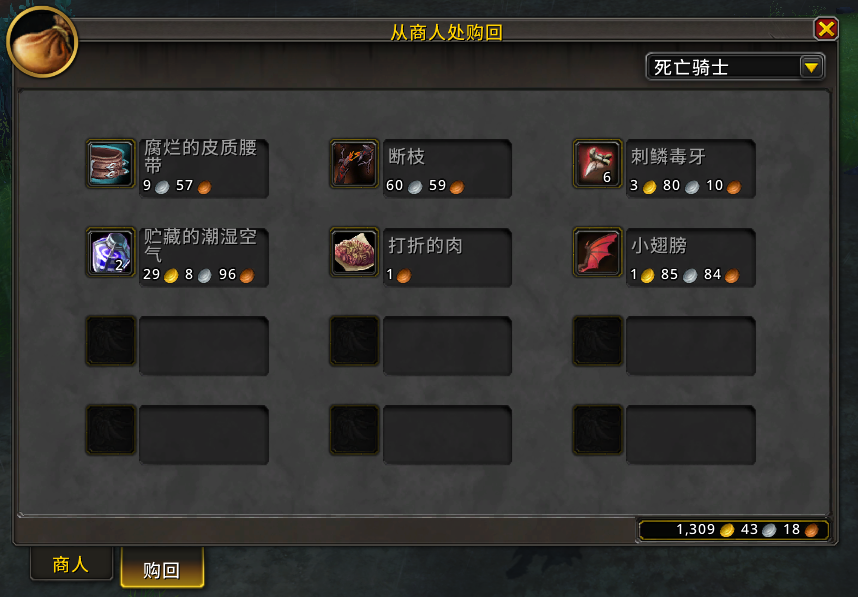

# ExtUI-Merchant

[**ExtUI-Merchant**](https://github.com/zhengqingquan/ExtUI-Merchant) 是一款扩展商人界面的插件！它可以使你更方便地浏览商品！

  
  

可以点击下方链接之一进行下载：

1. [github | releases](https://github.com/zhengqingquan/ExtUI-Merchant/releases)
2. [curseforge | extui-merchant](https://www.curseforge.com/wow/addons/extui-merchant)
3. [legacy.curseforge | extui-merchant](https://legacy.curseforge.com/wow/addons/extui-merchant)

## 简介

原版插件名为：Extended Vendor UI，作者为：Germbread，但已经很长时间没有更新了。同样有另一款类似的插件叫：Vendorer（而非Vendor），这款插件也已经很长时间没有更新了。

ExtUI-Merchant 原本只是为了学习写插件而分离出来的功能。取名 Merchant 主要也是为了和原本的名字区分开来。

ExtUI-Merchant 在 Extended Vendor UI 的基础上砍掉了不需要的功能。目前只保留了扩展商人面板的功能。保持插件的干净和独立的特性。

## 支持版本

插件支持正式服版本。

很抱歉，暂不支持怀旧服。
